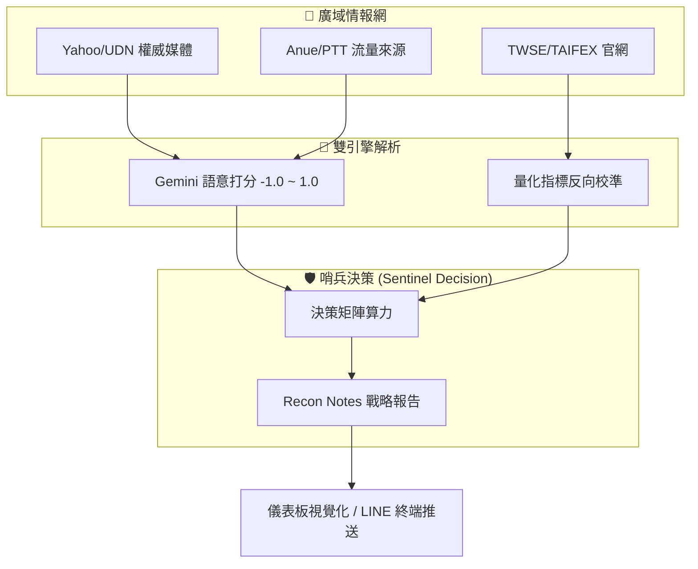

# 🛡️ DualBear Sentinel Alpha：台股輿情與量化雙引擎決策系統

> **系統願景**：結合 AI 語意解析與官方籌碼實相，打造冷靜、理性的市場哨兵。

---

## 📡 1. 情報偵察網 (Intelligence Sources)
系統透過「廣域偵察特工」同時監控以下五大真理與情緒來源：

| 來源類型 | 平台 | 偵察職責 | 戰略價值 |
| :--- | :--- | :--- | :--- |
| **官方真理** | **TWSE (證交所)** | VIX 指數、融資餘額、官報數據 | 市場波動真理，避開第三方延遲與誤差。 |
| **權威媒體** | **經濟日報 (UDN)** | 宏觀經濟、法人觀點、產業新聞 | 判讀官方引導的市場風向與主流議題。 |
| **即時情報** | **鉅亨網 (Anue)** | 即時重大訊息、法說會摘要 | 追求市場重大事件的反應速度。 |
| **大眾情緒** | **Yahoo 股市** | 大眾新聞、熱門搜尋、留言情緒 | 偵察一般社會大眾的關注熱點與集體偏見。 |
| **社群脈動** | **PTT Stock 板** | 鄉民討論、推文情緒、反向指標 | 判斷散戶參與度與市場情緒過熱/恐慌程度。 |

---

## 🧠 2. 核心精算邏輯 (Jade & Opal Algorithms)
系統決策由「語意分數」與「量化權重」二階段聯動組成。

### A. 第一階段：AI 語意解析 (Sentiment Scoring)
由 **Gemini 2.0** 針對每則情報進行 `-1.0 (極度利空)` 到 `+1.0 (極度利多)` 的動態打分：
*   **專業新聞**：權重較高，專注於產業實質財報與獲利變動。
*   **社群輿情**：權重較低，但作為「情緒溢價」或「非理性殺盤」的關鍵指標。

### B. 第二階段：量化反向修正 (Contrarian Adjustment)
系統會比對 **TWSE (官網)** 與 **WantGoo (可靠指標)** 的數據，執行「反向修正策略」：

| 監控指標 | 觸發紅線 | 戰略修正 (目標倉位) | 核心戰術理由 |
| :--- | :--- | :--- | :--- |
| **融資維持率** | `< 140%` | **+15% ~ +20%** | 市場進入斷頭洗盤區，具備極強反彈動能。 |
| **散戶多空比** | `> +30%` | **-15%** | 散戶瘋狂看多，市場過於擁擠且脆弱，準備退場。 |
| **恐慌指數 (VIX)**| `> 25` | **+10%** | 市場非理性恐慌，優質標的大幅偏離內在價值。 |

---

## 🛡️ 3. 決策矩陣 (Decision Matrix)
最終的「目標倉位」與「戰略決定」會顯示在儀表板中央，邏輯嚴守以下矩陣：

*   **⚡ 全力戒備 (Target 80%+)**：輿情極度悲觀 + 量化斷頭洗盤 = 世紀大底部，大膽分批布局。
*   **⚖️ 持盈保泰 (Target 40-60%)**：市場情緒與籌碼維持平衡，專注於強勢產業。
*   **🛑 撤離避險 (Target 0-20%)**：輿情瘋狂利多 + 散戶追價度極高 = 非理性泡沫，保留現金實力。

---

> 📦 **預覽須知**：本圖使用 Mermaid 語法繪製。若在 VS Code 中看不到圖示，
> 請安裝擴充套件 [Markdown Preview Mermaid Support](https://marketplace.visualstudio.com/items?itemName=bierner.markdown-mermaid)
> （搜尋 `bierner.markdown-mermaid`）後，重新開啟 Markdown Preview 即可正常顯示。

---

## 🚀 4. 系統未來進展 (Roadmap)
*   **對接更多官方接口**：包含八大官股買賣超數據偵察。
*   **歷史回測系統**：將歷史偵察報告與大盤漲跌幅進行勝率校對。
*   **多代理協作**：引入 Koala 做風險警告，Polar Bear 做長期價值評核。

---
**雙熊帝國 戰略技術部 啟**
